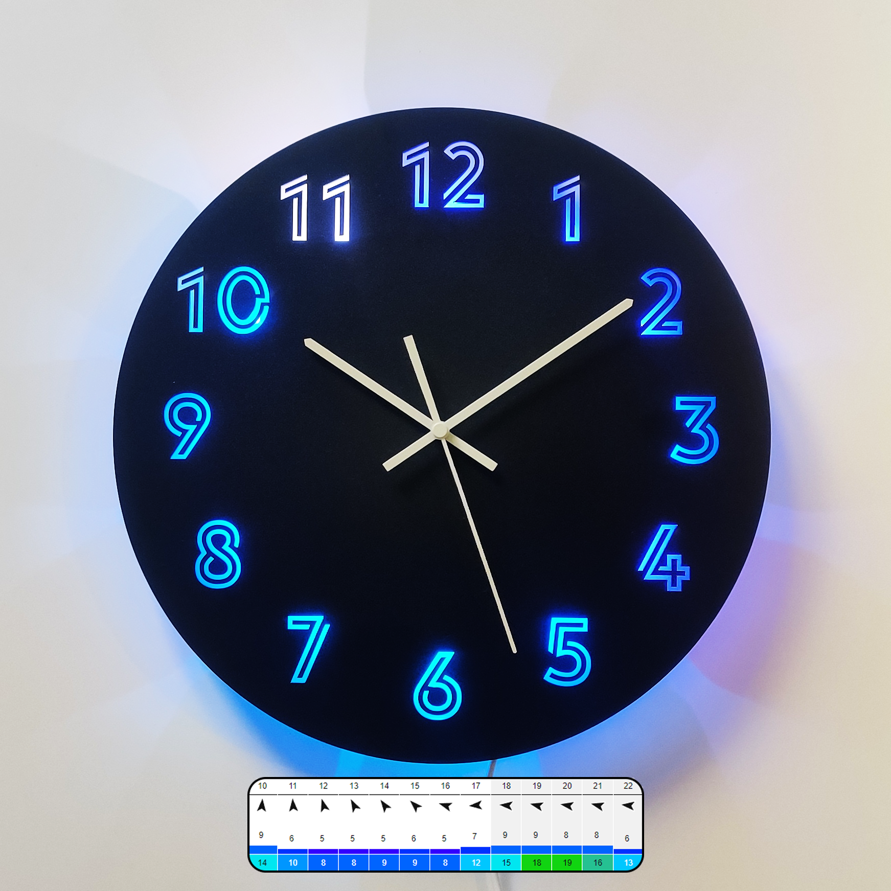
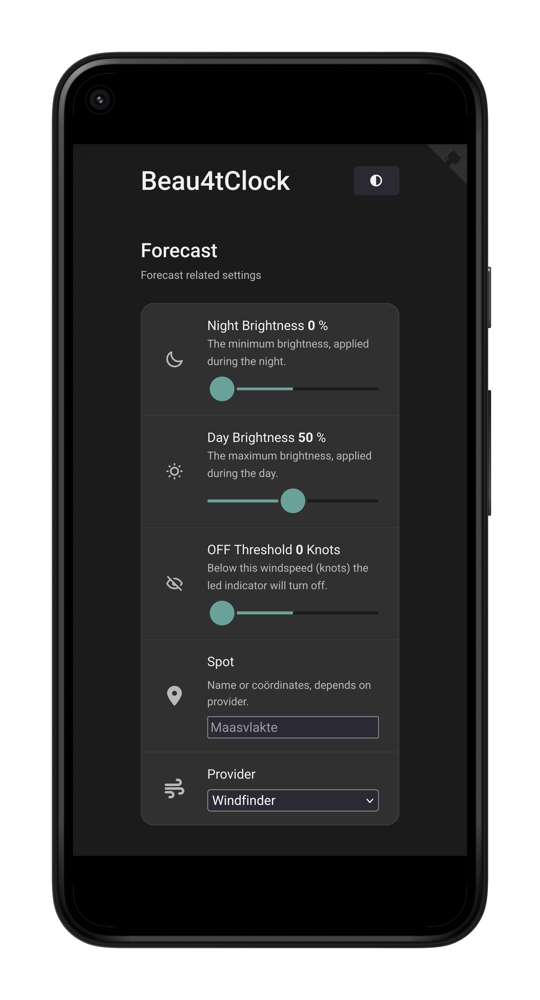
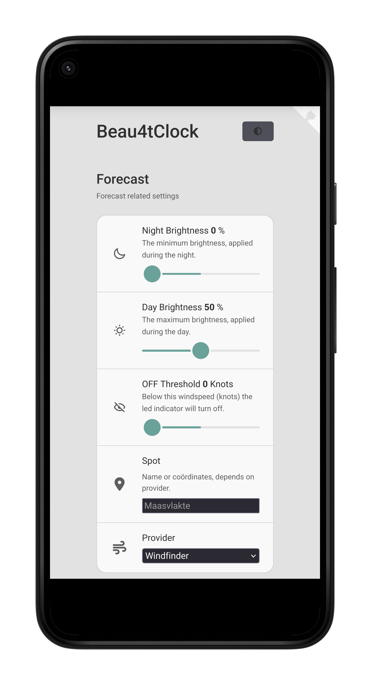
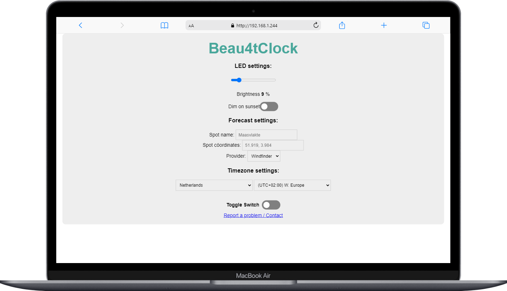

# Beau4tClock
Clock that projects the windforecast for the next 12 hours.

## Features
- Configure WiFi using portal
- Select spot using web interface 
- Select weather provider (Windfinder, Windguru, Windguru-Pro, Windy)
- Set timezone
- Set LED brightness
- Dim clock with the sun

## Components
- Clock 
- [Lolin NODEMCU V3](https://github.com/nodemcu/nodemcu-devkit-v1.0) (clone, CH340)
- [WS2812 5050 RGB LED ring](https://www.bitsandparts.nl/LED-Ringset-60x-WS2812-5050-RGB-LEDs-met-drivers-(klok)-p122267)
- 100uF capacitor (power supply smoothening)
- 220 Ohm resistor (noise reduction)

## Libraries and APIs used
- https://github.com/jeroentvb/wind-scrape

## Manual
1. Power on the device, it will initally go into Access Point mode.
2. Connect to the WiFi network "Beau4tcast" using the password "12345678"
3. Once connected you will be redirected to the WiFi portal. 
4. Scan for your own WiFi network and connect to it using its credentials.
5. Wait a few minutes so configuration can finish, once setup is completed the builtin blue LED will turn off. 
6. The webpage for configuration is reachable by its hostname "beau4tcast" or its IP Address. 
You can find the IP Address by listing all devices on your network (using an app: [Android](https://play.google.com/store/apps/details?id=net.techet.netanalyzerlite.an)/[IOS](https://apps.apple.com/nl/app/network-analyzer/id562315041)), and looking for the one with hostname "beau4tcast" and/or vendor "Espressif Inc." 
7. Configure the LED, spot, and timezone settings using the webinterface. 

___Note___: The field _'Spot name/id'_ accepts names and ids: 
· If you choose Windfinder as provider you will need to enter the _name_. You can find that at the end of the URL for example: [_'maasvlakte'_](https://www.windfinder.com/forecast/maasvlakte). 
· If you choose Windguru as provider you will need to enter the _id_. You can find that at the end of the URL for example: [_'4879'_](https://www.windguru.cz/4879). 

If an issue occurs you can always press the RESET button to reboot the device. 
Your WiFi credentials are stored permanent, if the device can't connect to the WiFi it will go into AccessPoint mode again.  
Note that on power up for a few minutes the WiFi portal will be reachable, you  can change the WiFi configuration there. 

### Preview

  
  

 

