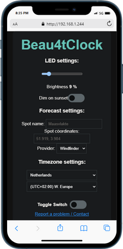
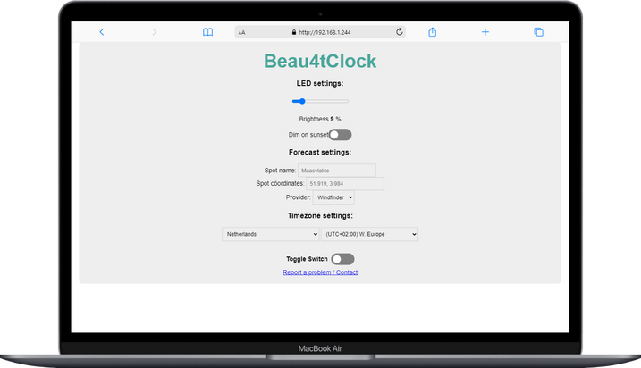

## Wiring

||||
| --- | --- | --- |
| LED strip 5 V|<--->|VV|
| LED strip GND|<--->|GND|
| LED strip DataIn |<--->|DI|
|BI is BackupInput, and isn't used by default 

## Initial setup
### 1. Power on
### 2. Connect to the WiFi netwerk 'Beau4tClock', with password '12345678'
### 3. You will be redirected to the portal, enter your WiFi credentials there.
### 4. When the Beau4tClock is connected succesfully to your WiFi network it will blink its IP address.
- When connection is unsuccesfull you can correct your WiFi credentials again in the portal (step 3).
### 5. Open the  IP address with a browser to configure the clock. 
- Power cycle the clock to see the IP address blinking again. This will also make the portal available again if you want to modify your WiFi credentials.

    
    

